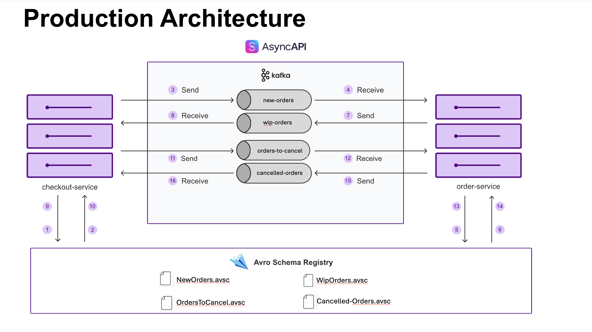

# Contract Testing with AsyncAPI & Avro Schema Registry

> **Production-ready contract testing for event-driven microservices using AsyncAPI specifications and Avro schemas**

## Overview

This sample demonstrates **contract-first development** for asynchronous microservices communication. It showcases how to implement reliable contract testing using AsyncAPI specifications with Avro Schema Registry integration.

## Architecture



The application demonstrates a typical order processing flow between `checkout-service` and `order-service` communicating through Kafka topics with Avro serialization.

## Key Value Propositions

### 🎯 Contract-First Development
- **AsyncAPI 3.0 specification** defines the contract upfront
- **Schema Registry integration** ensures runtime consistency
- **Automated contract testing** validates service interactions

### 🔄 Schema Evolution Management
- **Avro schemas** provide backward compatibility
- **Multi-format schema support** in AsyncAPI specifications
- **Dynamic schema references** to Schema Registry endpoints

### 🚀 Production Confidence
- **Automated validation** catches breaking changes early
- **Type-safe messaging** with generated POJOs
- **End-to-end testing** with real infrastructure

## AsyncAPI Specification Highlights

### Multi-Format Schema Integration

The AsyncAPI specification that this application is based on reuses the Avro schemas by referencing them instead of redefining them again. 
This ensures that we have a single source of truth for the schemas which is the schemas present in the schema registry.

```yaml
components:
  messages:
    OrderRequest:
      name: OrderRequest
      title: An order request
      payload:
        schemaFormat: 'application/vnd.apache.avro+json;version=1.9.0'
        schema:
          $ref: 'http://localhost:8085/subjects/new-orders-value/versions/1/schema'
```

### Key Benefits:
- **Live schema references** - Always uses current registry schemas
- **No schema duplication** - Single source of truth
- **Runtime validation** - Ensures spec-to-implementation consistency

## Schema Management

### Schema Organization
```
src/main/avro/
├── NewOrders.avsc          # Order creation events
├── WipOrders.avsc          # Work-in-progress updates
├── OrdersToCancel.avsc     # Cancellation requests
└── CancelledOrders.avsc    # Cancellation confirmations
```

### Registration Process
Schemas are automatically registered during test setup via `register-schemas.sh` script, ensuring tests run against the actual schema registry.

## Contract Testing Strategy

### What Gets Tested:
- **Message publishing** to correct topics
- **Schema compatibility** with registry
- **Consumer behavior** on message receipt
- **Error handling** for malformed messages

## Quick Start

### Prerequisites
- Java 17+
- Docker & Docker Compose

### Run Contract Tests Programmatically
```bash
# 1. Pull dependencies
docker compose pull

# 2. Execute contract tests
./gradlew clean test
```

You can also run the [contract test](src%2Ftest%2Fkotlin%2Fcom%2Fexample%2Forder%2FContractTest.kt) from your IDE using the play button once you've pull all the required images.
The contract test makes use of `testcontainers` to set up the environment for testing.

#### Test Configuration
Set these system properties for Specmatic:
```bash
SCHEMA_REGISTRY_URL=http://localhost:8081
SCHEMA_REGISTRY_KIND=CONFLUENT
AVAILABLE_SERVERS=localhost:9092
EXAMPLES_DIR=src/test/resources/examples
```

### Run Contract Tests using Docker CLI

#### Run tests
```bash
docker run --network avro-app-network \
       -v "$PWD/specmatic.yaml:/usr/src/app/specmatic.yaml" \
       -v "$PWD/api-specs:/usr/src/app/api-specs" \
       --rm specmatic/specmatic-kafka test \
       --broker=broker:9093 \
       --schema-registry-url=http://schema-registry:8085 \
       --schema-registry-kind=CONFLUENT
```

## Business Impact

### Development Benefits
- **Catch integration issues early** - Before they reach production
- **Reduce debugging time** - Type-safe contracts eliminate guesswork
- **Confident deployments** - Automated validation prevents failures

### Technical Benefits
- **Schema evolution safety** - Backward compatibility validation
- **Runtime consistency** - Specs match actual implementation
- **Automated testing** - No manual contract verification needed

## Why This Matters

Traditional integration testing often misses **contract compatibility issues** that only surface in production. This approach ensures:

1. **Services communicate correctly** - Validated message formats
2. **Schema changes don't break consumers** - Compatibility testing
3. **Deployments are safe** - Contract validation in CI/CD
4. **Documentation stays current** - Living contracts via AsyncAPI

---

**Ready to implement contract testing in your microservices?** This sample provides the complete foundation for production-ready contract testing with AsyncAPI and Avro Schema Registry.
