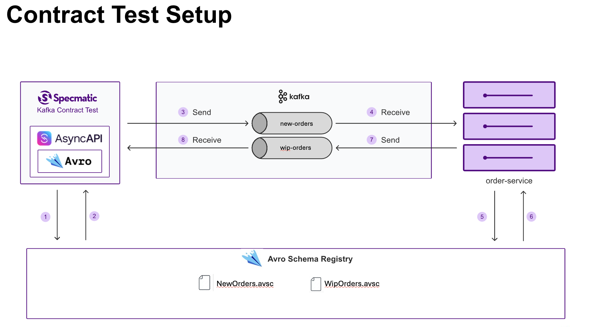

# Contract Testing with AsyncAPI & Avro Schema Registry

> **Leveraging your Avro schema files by referencing them from AsyncAPI spec to test your event-driven microservices**

## Overview

This project demonstrates **contract-driven development** using your Avro schemas for asynchronous microservices communication. It showcases how AsyncAPI specification can be used in conjunction with your Avro schemas to thoroughly contract test your EDA.


The diagram covers an order processing flow between `checkout-service` and `order-service` communicating through Kafka topics with Avro serialization for the payloads.

## Referencing your existing Avro files your schema registry in AsyncAPI spec

The AsyncAPI specification that this application is based on **reuses the Avro schemas by referencing them instead of redefining them again**. 
This ensures that we have **a single source of truth** for the schemas whic is the schema registry.

```yaml
components:
  messages:
    OrderRequest:
      name: OrderRequest
      title: An order request
      payload:
        schemaFormat: 'application/vnd.apache.avro+json;version=1.9.0'
        schema:
          $ref: 'http://localhost:8085/subjects/new-orders-value/versions/1/schema'
```

## Contract Testing the application

### Prerequisites
- Java 17+
- Docker & Docker Compose



The `order-service` is the system under test in our case.

### Run Contract Tests Programmatically
```bash
# 1. Pull dependencies
docker compose pull

# 2. Execute contract tests
./gradlew clean test
```

You can also run the [contract test](src%2Ftest%2Fkotlin%2Fcom%2Fexample%2Forder%2FContractTest.kt) from your IDE (Please run `docker compose pull` before running tests). The contract test makes use of `[testcontainers](https://testcontainers.com/)` to set up test environment.

#### Test Configuration
We only need to setup below properties in the [contract test](src%2Ftest%2Fkotlin%2Fcom%2Fexample%2Forder%2FContractTest.kt).
```properties
SCHEMA_REGISTRY_URL=http://localhost:8085
SCHEMA_REGISTRY_KIND=CONFLUENT
AVAILABLE_SERVERS=localhost:9092
```

### Run Contract Tests using Docker CLI

This will help you understand all the independent components involved in running the app, its dependencies and the contract test itself.

#### Run the application 
```bash
# 1. Pull dependencies
docker compose pull

# 2. Run the dependencies
docker compose up -d

# 3. Run the application
./gradlew bootRun
```

#### Run the contract tests
Wait for the application to start and then run the following command to execute the contract tests using Specmatic:

```bash
docker run --network avro-app-network \
       -v "$PWD/specmatic.yaml:/usr/src/app/specmatic.yaml" \
       -v "$PWD/api-specs:/usr/src/app/api-specs" \
       -v "$PWD/build:/usr/src/app/build" \
       --rm specmatic/specmatic-kafka:1.0.1 test \
       --broker=broker:9093 \
       --schema-registry-url=http://schema-registry:8085 \
       --schema-registry-kind=CONFLUENT
```

#### Stop the application
Stop the application by stopping the `./gradle bootRun` process using Ctrl + C

#### Stop the containers 
```bash
docker compose down -v
```

### What all are we testing with Specmatic Contract Test:
- **Message delivery** to correct topics
- **Schema compatibility** with registry
- **Consumer behavior** on message receipt
- **Error handling** for malformed messages
- **And more ...**

## Schema Management

### Schema Organization
```
src/main/avro/
├── NewOrders.avsc          # Order creation events
├── WipOrders.avsc          # Work-in-progress updates
├── OrdersToCancel.avsc     # Cancellation requests
└── CancelledOrders.avsc    # Cancellation confirmations
```

### Registration Process
Schemas are automatically registered during test setup via `register-schemas.sh` script, ensuring tests run against the actual schema registry.

## Business Impact

### Development Benefits
- **Catch integration issues early** - Before they reach higher environments
- **Reduce debugging time** - Eliminate guesswork
- **Confident deployments** - Automated validation prevents failures

### Technical Benefits
- **Schema evolution safety** - Backward compatibility validation
- **Avoid API-Drift** - Specs match actual implementation
- **Automated Testing** - No manual contract verification needed, nor do you need to write or maintain any test code

## Why This Matters

Traditional integration testing often misses **contract compatibility issues** that only surface in production. Leveraging AsyncAPI spec with Avro schemas for Contract Testing ensures:

1. **Services communicate correctly** - Validated message formats
2. **Schema changes don't break consumers** - Compatibility testing
3. **Deployments are safe** - Contract validation in CI/CD
4. **Collaboration with ** - Living contracts via AsyncAPI
